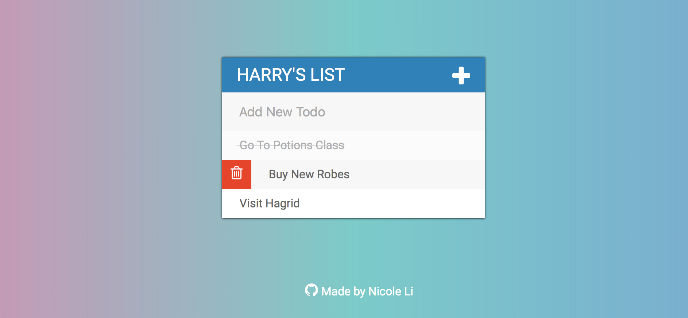

# jQuery-Todo

## Try it out
https://nicolehli.github.io/jQuery-todo-list/

## Features Implemented
- [x] + will hide Input Field
- [x] title
- [x] text input to add new todo item
- [x] ul-li item list
- [x] hover over li item will show delete feature
- [x] delete button span will remove html item
- [x] show li item in a list
- [x] div contains the whole todo list
- [x] strikethrough done items toggling

## Show and Tell

## Built With
HTML, CSS, jQuery

## Acknowledgements
This project was completed as part of The Web Developer Bootcamp (Udemy) course by Colt Steele
